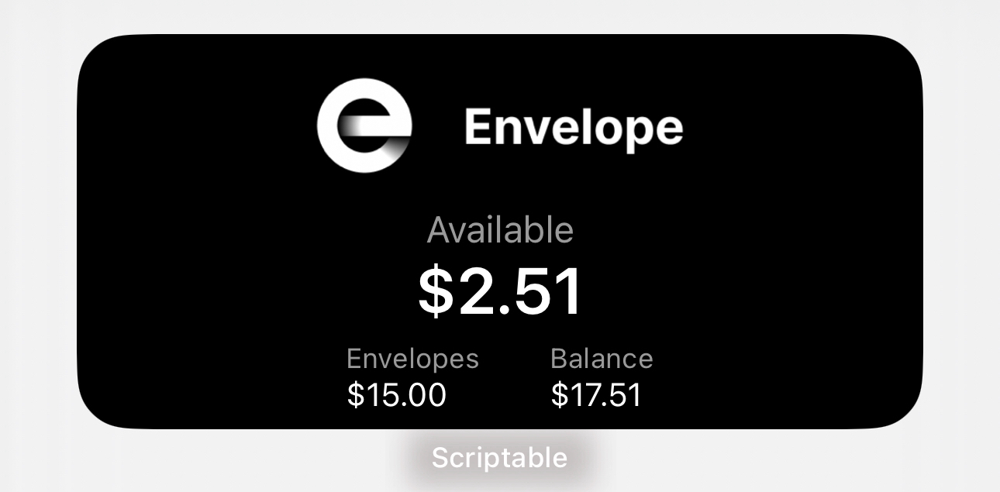

# Envelope Budget Widget 📊
[](https://opensource.org/licenses/MIT)
[](https://www.apple.com/ios/)
[](https://scriptable.app/)

A minimalist iOS widget built with Scriptable to display your Envelope Money budget information right on your home screen.

## Widget Appearance 🎨

### Dark Mode (Default)


### Widget in Action
Here's how it looks on the home screen:


## Features ✨

- Display Available Balance
- Show Envelopes Total
- View Account Balance
- Clean, minimalist design
- Auto-refresh every 5 minutes
- Dark mode support

## Prerequisites 📋

- iOS device running iOS 14.0 or later
- [Scriptable](https://apps.apple.com/us/app/scriptable/id1405459188) app installed
- [Envelope Money](https://www.envelopemoney.com/) account
- [Charles Proxy](https://www.charlesproxy.com/download/) for token capture

## Installation 🚀

1. Clone this repository
```bash
git clone https://github.com/yourusername/envelope-budget-widget.git
```

2. Copy `EnvelopeWidget.js` to Scriptable on your iOS device

3. Follow the token capture process below

## Token Capture Process 🔐

### Windows Setup with Charles Proxy

1. **Install Charles Proxy**
   - Download from [charlesproxy.com](https://www.charlesproxy.com/download/)
   - Install and launch Charles Proxy
   - Install Root Certificate: `Help > SSL Proxying > Install Charles Root Certificate`

2. **Configure SSL Proxying**
   - Navigate to `Proxy > SSL Proxying Settings`
   - Add new location:
     ```
     Host: api.envelopemoney.com
     Port: 443
     ```

### iOS Configuration

1. **Set up HTTP Proxy**
   - Connect to same WiFi as your PC
   - Settings > Wi-Fi > Your Network (i)
   - Configure Proxy > Manual
   - Server: Your PC's IP
   - Port: 8888

2. **Install SSL Certificate**
   - Visit `chls.pro/ssl` in Safari
   - Install the certificate
   - Enable in Settings: `General > About > Certificate Trust Settings`

### Capture Authentication Data

1. Open Envelope Money app on your iOS device
2. Monitor traffic in Charles Proxy
3. Look for GraphQL requests to `api.envelopemoney.com`
4. Extract these values:
   ```javascript
   const AUTH_TOKEN = ""; // From auth-token-stytch header
   const DEVICE_TOKEN = ""; // From x-device-token header
   const REQUEST_SIGNATURE = ""; // From em-request-sha256-signature header
   const x_IPADDRESS = ""; // From x-ip-address header
   const CLIENT_VERSION = ""; // From apollographql-client-version header
   ```

## Configuration ⚙️

1. Open `EnvelopeWidget.js` in Scriptable
2. Replace the empty constants with your captured values
3. Create a new widget on your home screen
4. Select Scriptable and choose EnvelopeWidget

## Security Notes 🔒

- Never share your tokens
- Don't commit tokens to GitHub
- Store tokens securely
- Tokens expire periodically
- Reset tokens by logging out/in of Envelope app

## Troubleshooting 🔍

### Can't See HTTPS Traffic
- Verify SSL certificate installation
- Check SSL Proxying settings
- Confirm certificate trust settings on iOS

### Connection Issues
- Verify same network connection
- Check proxy settings
- Disable firewall temporarily
- Verify port 8888 isn't blocked

## Contributing 🤝

1. Fork the repository
2. Create feature branch
3. Commit changes
4. Push to branch
5. Open pull request

## License 📄

This project is licensed under the MIT License - see [LICENSE](LICENSE) file for details.

## Disclaimer ⚠️

This project is not affiliated with or endorsed by Envelope Money. Use at your own risk.

## Support 💬

- Open an issue for bugs
- Submit feature requests via issues
- Check [Discussions](../../discussions) for questions

## Star History 🌟

[](https://star-history.com/#yourusername/envelope-budget-widget&Date)
